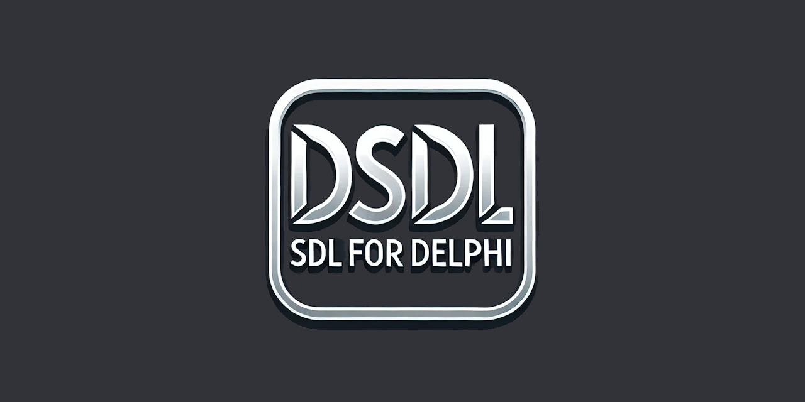

  
[](https://discord.gg/tPWjMwK)
[](https://bsky.app/profile/tinybiggames.com)

**DSDL** - SDL for Delphi 🎮 is a powerful **Delphi-native** framework that integrates the robust features of **SDL3** and its related libraries with enhanced capabilities like **Spine Runtime Animation**, **MPEG-1 Video Playback**, and **Secure ZIP-based I/O Support**. This library is designed to help developers build modern, high-performance **2D games** and **multimedia applications** efficiently.

## Table of Contents 📖

1. [🚀 Features](#features)
2. [🏁 Getting Started](#getting-started)
3. [🛠️ Installation](#installation)
4. [📖 Usage Guide](#usage-guide)
5. [🧩 Code Examples](#code-examples)
6. [📚 Dependencies](#dependencies)
7. [📄 License](#license)
8. [🙌 Acknowledgements](#acknowledgements)
9. [🤝 Contributing](#contributing)

## Features

### 1. **Password-Protected ZIP Support 📦**
   - Read files (textures, audio, configurations, etc.) directly from password-protected ZIP archives.
   - No need for pre-extraction, saving storage and time.
   - Seamless integration using SDL's `SDL_IOStream` interface.

**Use Case:**
   - Load compressed assets in real-time while maintaining security.


### 2. **MPEG-1 Video Playback 🎬**
   - Play MPEG-1 videos with **real-time streaming** support directly from ZIP archives.
   - Designed to be lightweight and optimized for minimal resource usage.
   - Smooth integration with SDL's rendering pipeline.

**Use Case:**
   - In-game cutscenes, intro videos, or dynamic multimedia overlays.

### 3. **Spine Animation Support 🦴**
   - Full integration with Spine runtime for smooth, real-time **2D character animations**.
   - Supports `.json` and `.atlas` files.
   - Key Features:
      - Dynamic animation states
      - Smooth blending
      - Clipping masks
      - Premultiplied alpha transparency for crystal-clear visuals.

**Use Case:**
   - Create lively, animated characters and scenes with Spine-based animations.

### 4. **Frame Rate Limiting and Timing Support ⏱️**
   - Precise control over frame rate to ensure smooth and consistent performance.
   - Synchronizes game logic updates with rendering cycles.
   - Reduces CPU/GPU usage and enhances energy efficiency.

**Use Case:**
   - Develop applications that require stable frame rates and optimized performance.

### 5. **Simplified SDL Utilities 🛠️**
   - Enhanced helper routines for:
      - Window creation
      - Input handling
      - Texture loading
      - Error management
   - Reduces boilerplate code and accelerates development.

**Use Case:**
   - Simplify the process of managing common tasks in SDL projects.

## Getting Started

### Prerequisites 📋

- **Delphi 12 CE or higher** 🖥️
- **Windows 10 or higher** 🪟
- **Tested on Windows 11 64-bit (24H2), Delphi 12.2** ✅

### Installation

1. Clone or [download](https://github.com/tinyBigGAMES/DSDL/archive/refs/heads/main.zip) the repository:
   ```bash
   git clone https://github.com/your-repo/dsdl.git
   cd dsdl
   ```

2. Add the library files to your Delphi project:
   - Include the `DSDL.pas` (or relevant units) into your project source.
   - SDL3 and other dependencies will be linked inside your executable.

3. Compile and run your project.

## Usage Guide

### Basic Setup

Here is how you initialize a window, load assets, and use the framework:

1. **Initializing SDL and Creating a Window**
   ```delphi
   uses
     DSDL;

   var
     Window: PSDL_Window;
     Renderer: PSDL_Renderer;
   begin
     if SDL_Init(SDL_INIT_VIDEO) <> 0 then
       Exit;

     Window := SDL_CreateWindow('DSDL Window', 100, 100, 800, 600, SDL_WINDOW_SHOWN);
     Renderer := SDL_CreateRenderer(Window, -1, SDL_RENDERER_ACCELERATED or SDL_RENDERER_PRESENTVSYNC);

     // Your code goes here...

     SDL_DestroyWindow(Window);
     SDL_Quit;
   end;
   ```

2. **Loading Spine Animations**
   ```delphi
   var
     Atlas: PspAtlas;
     SkeletonData: PspSkeletonData;
     Drawable: PspSkeletonDrawable;
   begin
     Atlas := spAtlas_createFromFile('data/spineboy-pma.atlas', Renderer);
     SkeletonData := spSkeletonJson_readSkeletonDataFile(Atlas, 'data/spineboy-pro.json');
     Drawable := spSkeletonDrawable_create(SkeletonData);

     Drawable^.Skeleton^.X := 400;
     Drawable^.Skeleton^.Y := 500;

     // Update and draw skeleton
     spSkeletonDrawable_update(Drawable, DeltaTime, SP_PHYSICS_UPDATE);
     spSkeletonDrawable_draw(Drawable, Renderer);
   end;
   ```

3. **Playing MPEG-1 Videos**
   ```delphi
   begin
    // Load and play a video file from the ZIP archive.
    SDL_LoadPlayVideoFromZipFile(LRenderer, 'Data.zip', 'res/videos/sample01.mpg', 0.1, -1);
    
     ...  
     // Update video playback timing.
     SDL_UpdateVideo(SDL_GetFramerateDuration());

     ...
     // Render the video content.
     SDL_RenderVideo(LRenderer, 0, 0, 0.5);
     
   end;
   ```

4. **Reading from Password-Protected ZIP Files**
   ```delphi
   var
     LRenderer: PSDL_Renderer;
     LTexture: PSDL_Texture;
   begin
     ...  
     // Load an image texture from the ZIP archive.
     LTexture := IMG_LoadTexture_IO(LRenderer, SDL_IOFromZipFile('Data.zip',
       'res/images/cute_kitten.jpg'), True);

     ...
     SDL_DestroyTexture(LTexture);
   end;
   ```

## Code Examples

### Full Spine Animation Example
```delphi  
uses
  DSDL;
  
var
  LWindow: PSDL_Window;                  // Pointer to the SDL window.
  LRenderer: PSDL_Renderer;              // Pointer to the SDL renderer.
  LAtlas: PspAtlas;                      // Atlas for Spine animation textures.
  LSkeletonJson: PspSkeletonJson;        // JSON parser for Spine skeleton data.
  LSkeletonData: PspSkeletonData;        // Spine skeleton data.
  LAnimationStateData: PspAnimationStateData; // State data for animation transitions.
  LDrawable: PspSkeletonDrawable;        // Drawable object for the Spine skeleton.
  LEvent: SDL_Event;                     // Event structure for SDL event handling.
  LQuit: Boolean;                        // Flag to control the main loop.
  LLastFrameTime, LNow: UInt64;          // Variables for frame timing.
  LDeltaTime: Double;                    // Time elapsed between frames.
begin
  // Initialize SDL video subsystem.
  if not SDL_Init(SDL_INIT_VIDEO) then
  begin
    Writeln('Error: ', SDL_GetError); // Print SDL initialization error.
    Exit; // Exit if initialization fails.
  end;

  // Create an SDL window with the specified title and size.
  LWindow := SDL_CreateWindow('DSDL: Load spine animation from file', 800, 600, 0);
  if LWindow = nil then
  begin
    Writeln('Error: ', SDL_GetError); // Print window creation error.
    SDL_Quit; // Clean up SDL resources.
    Exit;
  end;

  // Create an SDL renderer for the window with OpenGL backend.
  LRenderer := SDL_CreateRenderer(LWindow, 'opengl');
  if LRenderer = nil then
  begin
    Writeln('Error: ', SDL_GetError); // Print renderer creation error.
    SDL_DestroyWindow(LWindow);       // Destroy the created window.
    SDL_Quit;                         // Clean up SDL resources.
    Exit;
  end;

  // Load the Spine animation atlas.
  LAtlas := spAtlas_createFromFile('res/spine/spineboy/spineboy-pma.atlas', LRenderer);

  // Create a skeleton JSON parser and scale the skeleton.
  LSkeletonJson := spSkeletonJson_create(LAtlas);
  LSkeletonJson.scale := 0.5;

  // Read skeleton data from the JSON file.
  LSkeletonData := spSkeletonJson_readSkeletonDataFile(LSkeletonJson,
    'res/spine/spineboy/spineboy-pro.json');

  // Create animation state data and set default transition mix.
  LAnimationStateData := spAnimationStateData_create(LSkeletonData);
  LAnimationStateData.defaultMix := 0.2;

  // Create a drawable skeleton object and set its initial position.
  LDrawable := spSkeletonDrawable_create(LSkeletonData, LAnimationStateData);
  LDrawable.usePremultipliedAlpha := -1; // Enable premultiplied alpha.
  LDrawable.skeleton^.x := 400;         // Set X position.
  LDrawable.skeleton^.y := 500;         // Set Y position.

  // Set the skeleton to its setup pose.
  spSkeleton_setToSetupPose(LDrawable.skeleton);

  // Perform an initial skeleton update.
  spSkeletonDrawable_update(LDrawable, 0, SP_PHYSICS_UPDATE);

  // Set initial animation state: 'portal' followed by 'run' (looped).
  spAnimationState_setAnimationByName(LDrawable.animationState, 0, 'portal', 0);
  spAnimationState_addAnimationByName(LDrawable.animationState, 0, 'run', -1, 0);

  // Initialize the quit flag and timing variables.
  LQuit := False;
  LLastFrameTime := SDL_GetPerformanceCounter;

  // Main event loop.
  while not LQuit do
  begin
    // Poll SDL events.
    while SDL_PollEvent(@LEvent) do
    begin
      // Exit the loop if a quit event is detected.
      if LEvent.&type = SDL_EVENT_QUIT then
      begin
        LQuit := True;
        Break;
      end;
    end;

    // Clear the screen with a specified color.
    SDL_SetRenderDrawColor(LRenderer, 94, 93, 96, 255);
    SDL_RenderClear(LRenderer);

    // Calculate delta time (time between frames) for smooth animation.
    LNow := SDL_GetPerformanceCounter;
    LDeltaTime := (LNow - LLastFrameTime) / SDL_GetPerformanceFrequency;
    LLastFrameTime := LNow;

    // Update the skeleton animation based on delta time.
    spSkeletonDrawable_update(LDrawable, LDeltaTime, SP_PHYSICS_UPDATE);

    // Draw the updated skeleton on the renderer.
    spSkeletonDrawable_draw(LDrawable, LRenderer);

    // Present the rendered frame to the window.
    SDL_RenderPresent(LRenderer);
  end;
```

## Dependencies

This project uses the following open-source libraries:
- [pl_mpeg](https://github.com/phoboslab/pl_mpeg)
- [SDL](https://github.com/libsdl-org/SDL)
- [SDL_image](https://github.com/libsdl-org/SDL_image)
- [SDL_mixer](https://github.com/libsdl-org/SDL_mixer)
- [SDL_net](https://github.com/libsdl-org/SDL_net)
- [SDL_ttf](https://github.com/libsdl-org/SDL_ttf)
- [Spine Runtimes](https://github.com/EsotericSoftware/spine-runtimes)
- [zlib](https://github.com/madler/zlib)

## License

**DSDL** is distributed under the 🆓 **BSD-3-Clause License**, allowing for redistribution and use in both source and binary forms, with or without modification, under specific conditions. See the [LICENSE](https://github.com/tinyBigGAMES/DSDL?tab=BSD-3-Clause-1-ov-file#BSD-3-Clause-1-ov-file) file for more details.

## Acknowledgements

Special thanks to the maintainers of:
- **Esoteric Software** for Spine Runtime
- **SDL** team for providing an amazing multimedia library
- **Open-source contributors** for pl_mpeg, zlib, and SDL extensions.

## Media

### Podcast Deep Dive
Explore the in-depth discussion about DSDL, its features, and its use cases.

https://github.com/user-attachments/assets/8d735ed7-a765-4da2-8a81-be8cc1b5a3fc

### Extensions
Load spine animation from zipfile

https://github.com/user-attachments/assets/3f3d4aae-7db4-46b5-9f1b-56247077d94b

Video Playback from zipfile

https://github.com/user-attachments/assets/90805b12-2cc7-47be-9a26-f70e26da0b0b


## Contributing

Contributions to **DSDL** are highly encouraged. Please feel free to submit issues, suggest new features, or create pull requests to expand the capabilities and robustness of the scripting engine.


## Support

- <a href="https://github.com/tinyBigGAMES/DSDL/issues" target="_blank">Issues</a>
- <a href="https://github.com/tinyBigGAMES/DSDL/discussions" target="_blank">Discussions</a>
- <a href="https://wiki.libsdl.org/SDL3/FrontPage/" target="_blank">SDL Wiki</a>
- <a href="https://learndelphi.org/" target="_blank">Learn Delphi</a>
---
With **DSDL**, you can build robust, modern 2D games and applications effortlessly. Whether you're animating characters, streaming videos, or managing secure resources, **DSDL** has you covered! 🎮🚀

<p align="center">

</p>
<h5 align="center">

Made with :heart: in Delphi
</h5>


